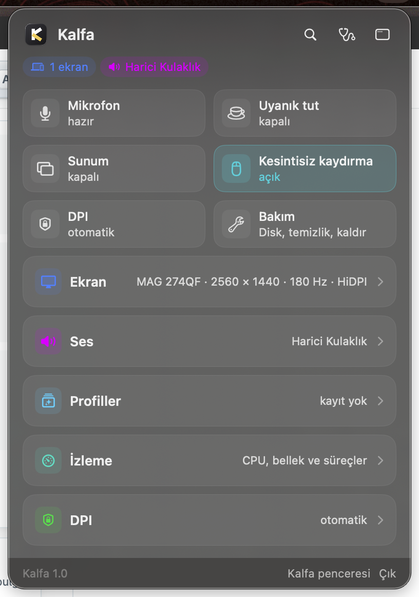
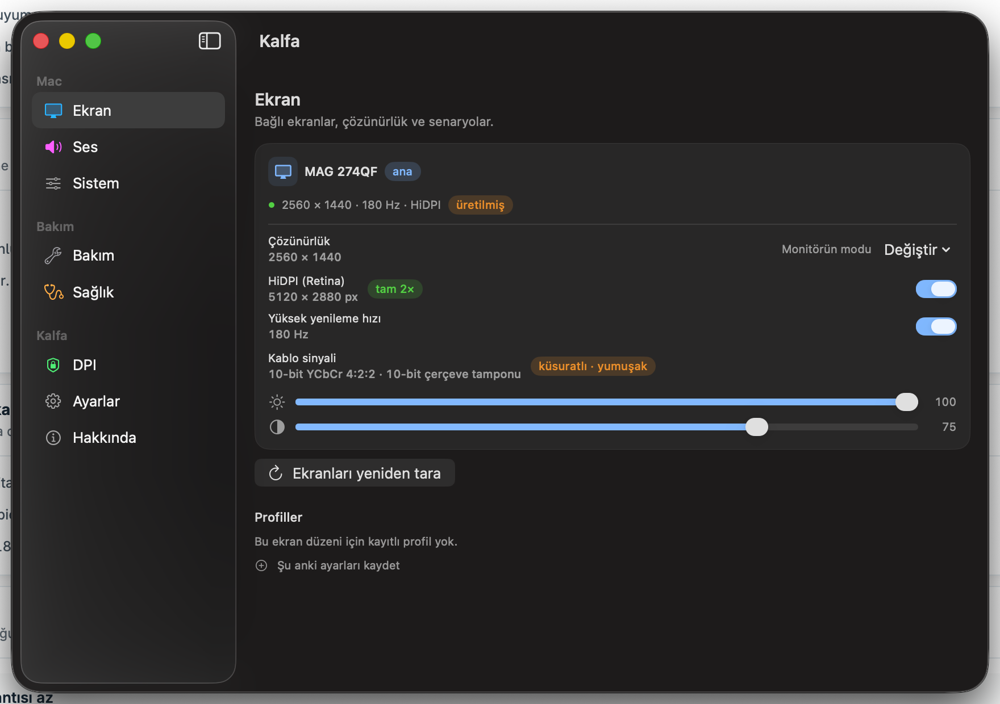
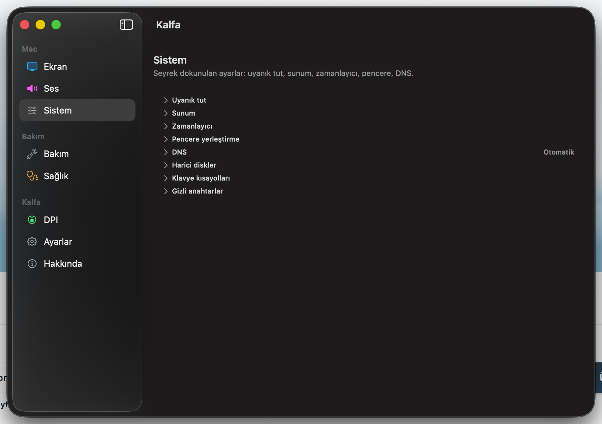
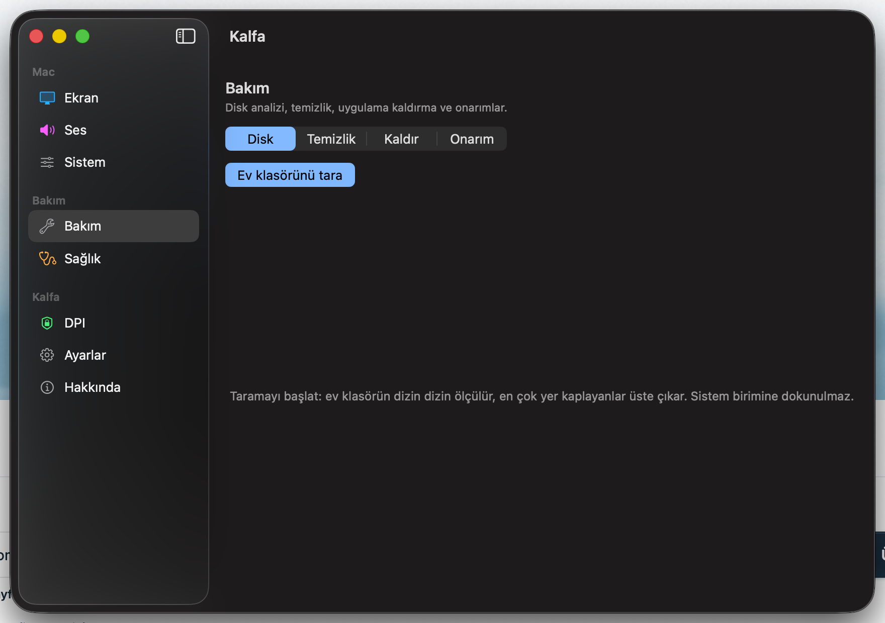
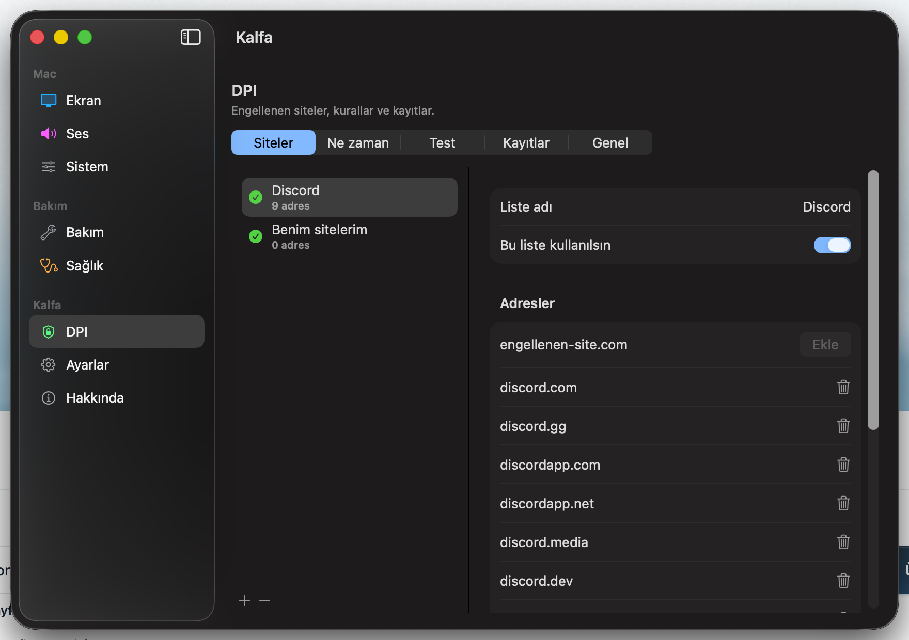
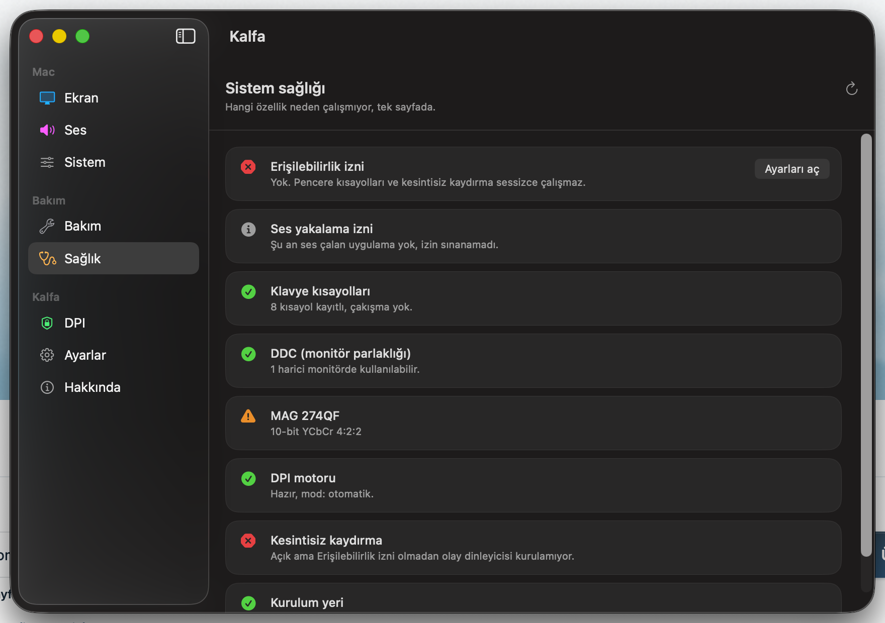

# Kalfa

**macOS menü çubuğundan ekranını, sesini, bakımını ve engellenen siteleri tek yerden yönet.**

Kalfa, menü çubuğunda yaşayan bir Mac aletidir. Ekran çözünürlüğü ve HiDPI, monitör
parlaklığı, ses cihazları, mikrofon susturma, uyanık tutma, sunum modu, pencere
yerleştirme, disk temizliği, uygulama kaldırma, kesintisiz fare kaydırması ve
engellenen sitelere erişim — hepsi aynı panelde.

[English](README.en.md) · macOS 14+ · Swift 6 · MIT

<p align="center">
  
</p>

---

## Neden var

Bir Mac'i kendine göre ayarlamak için genelde beş altı ayrı menü çubuğu uygulaması
kurarsın: biri çözünürlük için, biri kahve ikonuyla uykuyu engellemek için, biri fare
kaydırmasını düzeltmek için, biri disk temizliği için, biri de engellenen siteler için.
Hepsi ayrı ikon, ayrı ayar penceresi, ayrı güncelleme, ayrı izin kutusu.

Kalfa bu işleri tek uygulamada toplar. Menü çubuğunda tek bir ikon, ayarların tek bir
yerde, izinler bir kez verilir.

**Somut olarak neyi kolaylaştırır:**

| Durum | Kalfa'sız | Kalfa ile |
|---|---|---|
| MacBook kapağı kapalıyken harici monitör Retina olmaktan çıkıyor | macOS o modu listelemiyor, çözüm yok gibi | Pencere sunucusunun gizli listesinden bulup uygular |
| Toplantıda mikrofonu kapatmak | Hangi uygulama öndeyse onun düğmesi | ⌥⌘M ile sistem geneli, gerçek susturma |
| Sunuma girerken masaüstünü toparlamak | Dock'u gizle, simgeleri kaldır, uykuyu kapat — elle, tek tek | Tek anahtar, çıkışta hepsi eski hâline döner |
| Disk doldu | "Neyin yer kapladığını" tahmin etmek | Ev klasörünü 13 saniyede ölçer, en büyükleri sıralar |
| Bir uygulamayı kaldırmak | Uygulamayı çöpe at, kalıntılar diskte kalsın | Paket kimliğiyle eşleşen kalıntıları bulur, çöpe taşır |
| Engellenen bir site | VPN aç, tüm trafiğin yavaşlasın | Yalnız listelediğin adresler için devreye girer |
| Fare tekerleği zıplayarak kaydırıyor | Ayrı bir uygulama kur | Tek anahtar |

---

## Ne yapar

### Ekran



- **Çözünürlük ve HiDPI.** Her modun yanında piksel eşleşmesi etiketi var: *birebir*,
  *tam 2×* ya da *küsuratlı · yumuşak*. Metnin neden yumuşak göründüğünü tahmin etmek
  yerine okuyorsun.
- **Gizli modlar.** macOS'un listelemediği ama pencere sunucusunun bildiği modlar.
  MacBook kapağı kapalıyken 2560 × 1440 HiDPI'nin kaybolması bu yüzden olur; Kalfa o
  modu bulup uygular. Ayrıntı: [Neden özel API](#neden-özel-api-kullanıyor).
- **Onaylı geçiş.** Riskli bir mod uygulandığında 15 saniyelik geri sayım başlar.
  Ekran okunmaz hâle gelirse hiçbir şeye dokunmadan eski moda döner.
- **DDC parlaklık ve kontrast.** Harici monitörün kendi menüsüne girmeden.
- **Kablo sinyali.** Bağlantının renk biçimi ve bit derinliği (örn. 10-bit YCbCr 4:2:2).
  Salt okunur — macOS bunu seçmek için desteklenen bir yol sunmuyor — ama metnin neden
  yumuşadığını açıklayan ikinci sebep çoğu zaman budur.
- **Profiller.** Ekran düzenine göre kaydedilir; o düzen bağlandığında kendiliğinden
  uygulanabilir. İstersen ses çıkışı, DPI modu ve uyanık tutma durumu da profile girer.

### Ses

- Çıkış ve giriş cihazını menüden seç, seviyeleri ayarla.
- **Cihaz başına ses hafızası:** kulaklığa geri döndüğünde bıraktığın seviyeyle açılır.
- **Gerçek sistem geneli mikrofon susturma.** Uygulamanın kendi susturması değil,
  cihazın kendisi. Önde hangi toplantı uygulaması olursa olsun çalışır; susturulduğunda
  menü çubuğunda gösterge belirir.
- **Uygulama başına ses karıştırıcı** (macOS 14.2+).

### Sistem



- **Uyanık tut** — süreli ya da kapatana dek; "şu uygulamalar açıkken uyuma" kuralıyla.
- **Sunum modu** — Dock'u gizler, masaüstü simgelerini kaldırır, diğer ekranları karartır,
  uykuyu engeller. Kapatınca ve uygulamadan çıkınca hepsi geri gelir.
- **Zamanlayıcı** — belirli süre sonra uyut, ekranı kapat ya da kapat.
- **Pencere yerleştirme** — sol/sağ/üst/alt yarı, ortala, doldur; klavye kısayollarıyla.
- **DNS** — bağlı tüm ağ servislerine uygulanır, Wi-Fi'dan kabloya geçince seninle gelir.
- **Harici diskleri çıkar**, **gizli anahtarlar** (Finder gizli dosyalar, ekran görüntüsü
  biçimi ve klasörü, Dock gecikmesi), **klavye kısayolları**.

### Bakım



- **Disk analizi.** Ev klasörünü dizin dizin ölçer. Bu makinede 1,01 milyon dosya /
  180 GB → **13 saniye**. Treemap yok: sıralı liste + oransal çubuk, her satır tıklanır
  bir hedef.
- **Temizlik.** Önbellek, günlük, derleme çıktısı, çökme raporu, kurulum dosyası.
  Varsayılan olarak **yalnızca makinenin kendi yeniden ürettiği şeyler** işaretli gelir;
  proje çıktıları ve cihaz destek dosyaları işaretsiz durur.
- **Kaldırıcı.** Eşleştirme paket kimliğiyle yapılır, isimle değil — isimle eşleştirmek
  başka uygulamaların verisini yakalıyordu.
- **Onarım.** DNS önbelleği, Birlikte Aç listesi, Quick Look, Finder/Dock yeniden
  başlatma, Spotlight yeniden dizinleme.

> **Silme yok, çöp kutusuna taşıma var** (`FileManager.trashItem`). Fikrini
> değiştirirsen Finder'dan geri koyarsın. Tek istisna çöp kutusunun kendisini
> boşaltmaktır — bir klasör kendi içine taşınamaz — ve bu durumda arayüz kalıcı
> silme olacağını önceden söyler.
>
> Neye dokunulabileceğine tek bir karar noktası bakar (`Safety.swift`): yasak kökler,
> korunan kullanıcı klasörleri, ev dizini sınırı, uygulama paketleri için ayrı kapı ve
> çöp kutusu için ayrı kapı. 15 test bu kapıları sınar — `..` ile dışarı çıkmayı,
> `~` yazımını, komşu dizinlerin önek kazasını ve kalıcı silmenin yalnız tek bir
> yerde bulunduğunu.
>
> **Bilerek yok:** `purge` ya da "RAM temizle" düğmesi. macOS belleği zaten yönetir;
> zorla boşaltmak sonraki erişimi diskten okutur. Klasik yalancı hızlandırıcıdır.

### DPI — engellenen siteler



Türkiye'de ve benzeri yerlerde bazı siteler TLS el sıkışması sırasındaki sunucu adına
bakılarak engellenir. Kalfa yerel bir HTTP proxy'si çalıştırır ve **yalnızca senin
listelediğin adresler için** ilk paketi farklı bir şekilde gönderir: bayt bölme, sunucu
adının ortasından kesme, TLS kaydı parçalama ya da rastgele kesim. Sunucuya ulaşan
baytlar birebir aynıdır — değişen yalnızca yazmanın şeklidir.

- **Listelemediğin hiçbir adrese dokunulmaz.** Eşleşmeyen trafik olduğu gibi aktarılır,
  bu yüzden proxy sürekli açık kalabilir ve ödeme sayfaları etkilenmez.
- **Kendiliğinden devreye girer:** bir uygulama açıkken, belirli bir ağdayken ya da
  belirli saatlerde.
- **Test bölümü** her adresi önce doğrudan, sonra Kalfa üzerinden dener ve sonucu cümle
  olarak söyler: *"Engelli ama Kalfa ile açılıyor."*
- Motor **Kalfa'nın kendi kodudur**; pakete gömülü üçüncü taraf ikili yoktur.

> **Yapamadığı:** sahte TTL, sıra dışı segment ve benzeri desync teknikleri. Bunlar ham
> soket ister, o da root ya da Network Extension ister. Kalfa yönetici hakkı istemez.

### Sağlık



"Bu özellik neden çalışmıyor?" sorusunun tek sayfalık cevabı. Her satır sessizce
başarısız olabilen bir şeye karşılık gelir — verilmemiş bir izin, 4:2:2'ye düşmüş bir
monitör bağlantısı, başka bir uygulamanın kaptığı kısayol — ve düzelten düğmeyi taşır.

### Kesintisiz fare kaydırması

Fare tekerleği satır satır kaydırır, her çentikte bir zıplar. Kalfa her çentiği
trackpad'in zaten yaptığı gibi piksel piksel harekete çevirir. Trackpad ve Magic Mouse'a
dokunulmaz. Tek anahtar, ayar kaydırıcısı yok.

### Komut paleti

Kısayolla her yerden açılır, menü çubuğunu hedeflemeye gerek kalmaz. Türkçe arama
Türkçe karakterden bağımsızdır: "cozunurluk" yazınca "çözünürlük" bulunur.

---

## Nelerden esinlendi, neler birleştirildi

Kalfa iki ayrı uygulamanın birleşmesiyle doğdu ve üç açık kaynak projeden ders aldı.
Hangisinden ne alındığı ve ne **alınmadığı** aşağıda açıkça yazılıdır.

### Birleşen iki uygulama

| Uygulama | Neydi | Kalfa'da nerede |
|---|---|---|
| **Klapa** | Ekran yöneticisi: çözünürlük, HiDPI, DDC, profiller | Ekran bölümü ve uygulamanın çekirdeği |
| **ezDPI** | Engellenen sitelere erişim aracı | DPI bölümü (`Packages/EzDPIKit`) |

İkisi de bu deponun yazarına ait, ayrı ayrı çalışan menü çubuğu uygulamalarıydı.
17.09.2026'da tek pakete alındılar; ürün adı **Kalfa** oldu. Her ikisinin de kendi
`Log`, `Diagnostics`, `SettingsView` ve `L10n` tipi olduğu için DPI yarısı ayrı bir
yerel Swift paketi olarak durur — modül sınırı, tek bir tipi yeniden adlandırmadan bu
çakışmayı çözer.

Kullanıcı verisi eski klasörlerinde bırakıldı (`Application Support/Klapa` ve
`ezDPI`): adı güzelleştirmek için taşımak, mevcut kurulumların profillerini ve kural
listelerini sıfırlamak demekti.

### Esinlenilen projeler

| Proje | Lisansı | Ne alındı | Ne alınmadı |
|---|---|---|---|
| [BetterDisplay](https://github.com/waydabber/BetterDisplay) | Kapalı kaynak | Bir ekran yöneticisinin hangi soruları cevaplaması gerektiği | Kod okunmadı; sanal ekran, gamma/ICC ve çentik gizleme kapsam dışı bırakıldı |
| [FreeDisplay](https://github.com/huberdf/FreeDisplay) | Açık kaynak | Pencere sunucusunun gizli mod listesine ulaşma fikri | Uygulama sıfırdan yazıldı |
| [Mos](https://github.com/Caldis/Mos) | CC BY-NC | Kaydırma **davranışı**: çentik başına alt sınır, iki aşamalı süzgeç, girdi önceliği, kaydırma fazı göndermeme | **Tek satır kod kopyalanmadı.** Mos ticari kullanıma kapalı; kod alınsaydı Kalfa MIT olamazdı |
| [mole](https://github.com/tw93/mole) | GPL-3.0 | Bakım **özellik kümesi**: canlı izleme, disk analizi, kaldırıcı, temizlik | **Kod, dize ve kural listesi kopyalanmadı**, davranış sıfırdan yazıldı. Aksi hâlde Kalfa GPL'e geçmek zorunda kalırdı |
| [SpoofDPI](https://github.com/xvzc/SpoofDPI) | Apache-2.0 | Parçalama yaklaşımının kendisi | Eskiden ikili olarak pakete gömülüydü; **24.09.2026'da çıkarıldı**, yerine Kalfa'nın kendi motoru yazıldı |

Fikir düzeyinde borçlu olunan diğerleri: pencere yerleştirme için **Rectangle** ve
**Magnet**, uyanık tutma için **Amphetamine** ve **KeepingYouAwake**, komut paleti için
**Raycast**, panelin karo/kart dili için Apple'ın kendi **Denetim Merkezi**. Hiçbirinin
kodu kullanılmadı.

### Lisans neden önemliydi

Kalfa MIT. Bir GPL projesinden kod almak Kalfa'yı da GPL'e zorlar; CC BY-NC'den kod
almak ticari kullanımı kapatır. Bu yüzden mole ve Mos'tan **davranış** alındı,
**kod** alınmadı — ve alınan davranışlar burada, bu tabloda, açıkça yazılıdır.

---

## Kurulum

```bash
brew install xcodegen
git clone https://github.com/aliakpoyraz/kalfa.git
cd kalfa
./build.sh
cp -R dist/Kalfa.app /Applications/
```

Xcode gerekir; yalnız Command Line Tools ile uygulama paketi derlenemez. `build.sh`
`DEVELOPER_DIR`'i kendisi ayarlar, `xcode-select`'in neyi gösterdiği önemli değildir.

**Gereksinimler:** macOS 14 veya üzeri. DDC parlaklık için Apple Silicon; geri kalan her
şey Intel'de de çalışır.

**İlk açılışta** sağ tık → **Aç**. Uygulama ad-hoc imzalıdır.

> Ad-hoc imzanın bedeli: Erişilebilirlik izni imzaya bağlıdır, yani her yeniden
> derlemede izin düşer ve kesintisiz kaydırma durur. Gerçek bir Developer ID
> sertifikasıyla imzalanmış sürümde bu sorun yoktur.

### Dağıtılabilir sürüm

```bash
./release.sh 1.0
```

İmzalar, noterletir, damgalar ve `dist/Kalfa-1.0.zip` üretir. Gereken iki hazırlık
(Developer ID sertifikası ve saklanmış noterleme kimliği) `release.sh` dosyasının
başında yazılıdır.

---

## İzinler

Kalfa yalnızca gerçekten gereken izni, gerektiği anda ister.

| İzin | Ne için | Ne zaman |
|---|---|---|
| **Erişilebilirlik** | Kesintisiz kaydırma ve pencere yerleştirme | İlk kullanıldığında |
| **Ses kaydı** | Uygulama başına ses karıştırıcı | Karıştırıcı ilk açıldığında |
| **Konum** | Wi-Fi ağ adını okumak (macOS bunu konum izni sayar) | Yalnız bir kuralı ağ adına bağlarsan |
| **Yönetici** | Bazı onarım işleri | O işi çalıştırdığında; parola Kalfa'ya girmez, sistemin kendi kutusu açılır |

---

## Teşhis

```bash
/Applications/Kalfa.app/Contents/MacOS/Kalfa --dump
```

Bağlı ekranları, kullanılan modu, kablo sinyalini, DDC okumasını ve pencere sunucusunun
mod listesini yazdırır.

**URL şeması** — Kısayollar, Raycast ya da kabuk betiğinden:

```bash
open "kalfa://window?section=dpi"     # pencereyi DPI sayfasında aç
open "ezdpi://on"                     # DPI'yı sürekli açık moda al
open "ezdpi://auto"                   # kural kararı versin
open "ezdpi://relaunch?bundle=com.hnc.Discord"
```

---

## Mimari

```
Kalfa/                  uygulama hedefi — panel, pencere, servisler
Packages/KalfaUI/       paylaşılan görsel dil (karo/kart/satır) ve dize arama
Packages/EzDPIKit/      DPI yarısı: proxy motoru, kural değerlendirme, arayüzü
Packages/UpkeepKit/     bakım yarısı: ölçüm, disk taraması, temizlik, kaldırma
```

Üç yüzey vardır ve bir şey yalnız birinde bulunur: **panel** (günlük anahtarlar),
**pencere** (oturup yapılan işler), **komut paleti** (adıyla ulaşma).

### Neden özel API kullanıyor

`CGDisplayCopyAllDisplayModes`, MacBook kapağı kapalıyken harici monitörün en iyi HiDPI
modunu listelemiyor — masaüstü Retina olmaktan çıkıyor. Pencere sunucusunun kendi listesi
(304 mod; CoreGraphics 139 tanesini gösteriyor) o modu içeriyor. Kalfa belgelenmemiş
`CGSConfigureDisplayMode` çağrısıyla onu uygular ve bu modlarda güvenlik bayrağı
bulunmadığı için 15 saniyelik onay/geri alma sayacı çalıştırır.

Bunun iki sonucu var: uygulama **Mac App Store'a giremez** (özel API kullanımı tek başına
ret sebebidir) ve macOS'un gelecek bir sürümünde bu çağrı değişebilir.

---

## Kapsam dışı

- **Mac App Store.** Sandbox zorunludur ve Kalfa'nın yaptığı işlerin çoğu orada yasaktır:
  pencere sunucusunun özel mod listesi, olay dinleyicisi, sistem proxy'si, ev dizini
  genelinde tarama ve çöpe taşıma, DDC, yönetici yetkisiyle betik. Bu kategorideki
  uygulamaların hiçbiri orada değildir.
- Sanal ekran, gamma/ICC yönetimi, çentik gizleme.
- Root gerektiren DPI teknikleri.
- "RAM temizleme" ve benzeri yalancı hızlandırıcılar.

---

## Lisans

MIT — bkz. [LICENSE](LICENSE).

Kaydırma davranışı [Mos](https://github.com/Caldis/Mos) (CC BY-NC) örnek alınarak,
bakım özellikleri [mole](https://github.com/tw93/mole) (GPL-3.0) örnek alınarak
**sıfırdan yazılmıştır**; her iki projeden de kod alınmamıştır. Ayrıntı:
[Nelerden esinlendi](#nelerden-esinlendi-neler-birleştirildi).
